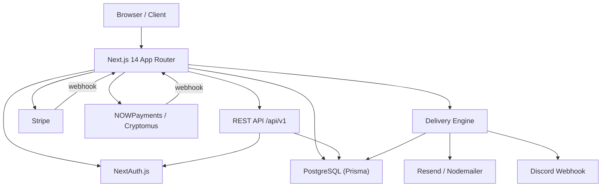
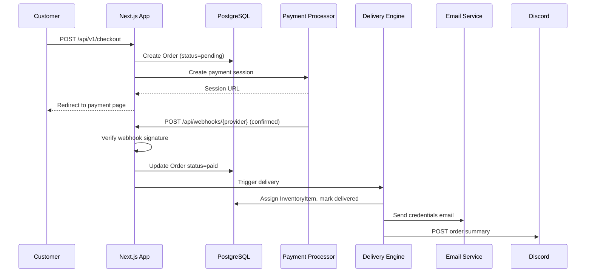

# Design Document: Velxo Digital Marketplace

## Overview

Velxo is a self-hosted, SaaS-grade digital product marketplace built on Next.js 14 App Router. It enables selling streaming subscriptions, AI tools, software licenses, and gaming products with instant automated delivery of credentials/license keys post-payment.

The system is organized around five core concerns:
1. **Storefront** — public-facing product catalog and landing pages
2. **Checkout & Payments** — Stripe + crypto payment flows with webhook processing
3. **Delivery Engine** — automated post-payment credential dispatch
4. **Admin Panel** — full back-office management
5. **Public API** — versioned REST API with OpenAPI docs

### Key Design Decisions

- **App Router only**: All routes use Next.js 14 App Router with React Server Components for performance. Client components are used only where interactivity is required.
- **Single repo, monolith**: No microservices. All logic lives in one Next.js app. This keeps deployment simple for a self-hosted product.
- **Prisma as the single source of truth**: All DB access goes through Prisma. No raw SQL except for analytics aggregations.
- **AES-256-GCM for credentials**: Inventory credentials are encrypted at rest. Decryption happens only in the delivery path, never in list views.
- **Webhook-first payment confirmation**: Orders are never marked paid from the client. Only verified webhook callbacks from Stripe/NOWPayments/Cryptomus trigger state transitions.

---

## Architecture



### Request Flow — Purchase



### Directory Structure

```
src/
  app/
    (storefront)/         # Public pages (RSC)
    (auth)/               # Login, register, reset
    dashboard/            # Customer dashboard
    admin/                # Admin panel (server-protected)
    api/
      v1/                 # Public REST API
      webhooks/           # Stripe + crypto webhook handlers
  components/
    ui/                   # Shared UI primitives
    storefront/           # Storefront-specific components
    admin/                # Admin-specific components
  lib/
    auth.ts               # NextAuth config
    db.ts                 # Prisma client singleton
    crypto.ts             # AES-256-GCM encrypt/decrypt
    delivery.ts           # Delivery Engine logic
    email.ts              # Email sending abstraction
    discord.ts            # Discord webhook dispatch
    stripe.ts             # Stripe client + helpers
    payments/             # NOWPayments / Cryptomus adapters
    rate-limit.ts         # IP-based rate limiter
  types/                  # Shared TypeScript types
prisma/
  schema.prisma
```

---

## Components and Interfaces

### Storefront Components

- `ProductCard` — displays title, price, category, stock status, average rating
- `ProductGrid` — filterable/searchable grid with client-side filter state
- `ProductDetail` — full product page with reviews, related products, buy button
- `HeroSection` — landing page hero with CTA
- `CategoryNav` — category filter navigation

### Checkout Flow

- `CheckoutButton` — initiates checkout, calls `POST /api/v1/checkout`
- `DiscountCodeInput` — validates and applies discount codes via `POST /api/v1/discount/validate`
- Stripe Checkout: redirect to Stripe-hosted page
- Crypto Checkout: redirect to NOWPayments/Cryptomus hosted page

### Delivery Engine (`lib/delivery.ts`)

```typescript
interface DeliveryResult {
  success: boolean;
  orderId: string;
  inventoryItemId?: string;
  error?: string;
}

async function deliverOrder(orderId: string): Promise<DeliveryResult>
async function retryDelivery(orderId: string): Promise<DeliveryResult>
```

The engine:
1. Finds one available `InventoryItem` for the product (atomic DB transaction)
2. Decrypts credentials
3. Sends delivery email
4. Marks item as `delivered`, decrements stock
5. Logs delivery record
6. Fires Discord webhook

### Admin Panel Routes

| Route | Purpose |
|---|---|
| `/admin` | Dashboard with analytics |
| `/admin/products` | Product CRUD |
| `/admin/products/[id]/inventory` | Bulk stock upload |
| `/admin/orders` | Order list + manual re-delivery |
| `/admin/users` | User list |
| `/admin/discounts` | Discount code management |
| `/admin/affiliates` | Affiliate management |
| `/admin/settings` | Discord webhook URL, commission % |

### REST API Endpoints (`/api/v1`)

| Method | Path | Auth | Description |
|---|---|---|---|
| GET | `/products` | None | List products with pagination |
| GET | `/products/:id` | None | Get product by ID |
| GET | `/orders` | Bearer | Authenticated user's orders |
| GET | `/orders/:id/delivery` | Bearer | Delivery details for an order |
| POST | `/checkout` | Bearer | Initiate checkout |
| POST | `/discount/validate` | Bearer | Validate discount code |
| GET | `/docs` | None | OpenAPI 3.0 spec |

All responses use the envelope:
```json
{
  "data": {},
  "error": null,
  "meta": { "page": 1, "total": 100 }
}
```

### Webhook Handlers

- `POST /api/webhooks/stripe` — verifies `stripe-signature` header, processes `checkout.session.completed` and `payment_intent.payment_failed`
- `POST /api/webhooks/nowpayments` — verifies HMAC-SHA512 signature
- `POST /api/webhooks/cryptomus` — verifies MD5 signature

---

## Data Models

```prisma
model User {
  id            String    @id @default(cuid())
  email         String    @unique
  passwordHash  String?
  name          String?
  role          Role      @default(CUSTOMER)
  emailVerified DateTime?
  createdAt     DateTime  @default(now())
  updatedAt     DateTime  @updatedAt

  orders        Order[]
  reviews       Review[]
  affiliate     Affiliate?
  sessions      Session[]
  loginAttempts LoginAttempt[]
}

enum Role {
  CUSTOMER
  ADMIN
}

model Product {
  id            String    @id @default(cuid())
  title         String
  description   String
  price         Decimal   @db.Decimal(10, 2)
  category      Category
  imageUrl      String?
  isActive      Boolean   @default(true)
  avgRating     Decimal   @default(0) @db.Decimal(3, 2)
  stockCount    Int       @default(0)
  createdAt     DateTime  @default(now())
  updatedAt     DateTime  @updatedAt

  inventory     InventoryItem[]
  orders        Order[]
  reviews       Review[]
}

enum Category {
  STREAMING
  AI_TOOLS
  SOFTWARE
  GAMING
}

model InventoryItem {
  id              String              @id @default(cuid())
  productId       String
  encryptedData   String              // AES-256-GCM encrypted credentials
  iv              String              // Initialization vector
  authTag         String              // GCM auth tag
  status          InventoryStatus     @default(AVAILABLE)
  createdAt       DateTime            @default(now())

  product         Product             @relation(fields: [productId], references: [id])
  deliveryLog     DeliveryLog?
}

enum InventoryStatus {
  AVAILABLE
  DELIVERED
}

model Order {
  id              String        @id @default(cuid())
  userId          String
  productId       String
  amount          Decimal       @db.Decimal(10, 2)
  discountAmount  Decimal       @default(0) @db.Decimal(10, 2)
  status          OrderStatus   @default(PENDING)
  paymentProvider String        // "stripe" | "nowpayments" | "cryptomus"
  paymentRef      String?       // External payment session/invoice ID
  discountCodeId  String?
  createdAt       DateTime      @default(now())
  updatedAt       DateTime      @updatedAt

  user            User          @relation(fields: [userId], references: [id])
  product         Product       @relation(fields: [productId], references: [id])
  deliveryLog     DeliveryLog?
  discountCode    DiscountCode? @relation(fields: [discountCodeId], references: [id])
}

enum OrderStatus {
  PENDING
  PAID
  FAILED
  PENDING_STOCK
  REFUNDED
}

model DeliveryLog {
  id              String        @id @default(cuid())
  orderId         String        @unique
  userId          String
  productId       String
  inventoryItemId String        @unique
  deliveredAt     DateTime      @default(now())

  order           Order         @relation(fields: [orderId], references: [id])
  inventoryItem   InventoryItem @relation(fields: [inventoryItemId], references: [id])
}

model DiscountCode {
  id            String        @id @default(cuid())
  code          String        @unique
  type          DiscountType
  value         Decimal       @db.Decimal(10, 2)
  usageLimit    Int
  usageCount    Int           @default(0)
  expiresAt     DateTime
  createdAt     DateTime      @default(now())

  orders        Order[]
  userUsages    DiscountUsage[]
}

enum DiscountType {
  PERCENTAGE
  FIXED
}

model DiscountUsage {
  id              String        @id @default(cuid())
  discountCodeId  String
  userId          String
  createdAt       DateTime      @default(now())

  discountCode    DiscountCode  @relation(fields: [discountCodeId], references: [id])

  @@unique([discountCodeId, userId])
}

model Review {
  id          String    @id @default(cuid())
  userId      String
  productId   String
  rating      Int       // 1-5
  comment     String?   @db.VarChar(1000)
  createdAt   DateTime  @default(now())

  user        User      @relation(fields: [userId], references: [id])
  product     Product   @relation(fields: [productId], references: [id])

  @@unique([userId, productId])
}

model Affiliate {
  id              String    @id @default(cuid())
  userId          String    @unique
  referralCode    String    @unique
  commissionPct   Decimal   @db.Decimal(5, 2)
  totalEarned     Decimal   @default(0) @db.Decimal(10, 2)
  pendingPayout   Decimal   @default(0) @db.Decimal(10, 2)
  createdAt       DateTime  @default(now())

  user            User      @relation(fields: [userId], references: [id])
  referrals       Referral[]
}

model Referral {
  id            String    @id @default(cuid())
  affiliateId   String
  referredUserId String   @unique
  createdAt     DateTime  @default(now())

  affiliate     Affiliate @relation(fields: [affiliateId], references: [id])
}

model WebhookLog {
  id          String    @id @default(cuid())
  provider    String
  eventType   String
  payload     Json
  status      String    // "processed" | "failed"
  createdAt   DateTime  @default(now())
}

model AdminAuditLog {
  id          String    @id @default(cuid())
  adminId     String
  action      String
  entityType  String
  entityId    String
  createdAt   DateTime  @default(now())
}

model LoginAttempt {
  id          String    @id @default(cuid())
  userId      String
  success     Boolean
  createdAt   DateTime  @default(now())

  user        User      @relation(fields: [userId], references: [id])
}

model Session {
  id           String   @id @default(cuid())
  sessionToken String   @unique
  userId       String
  expires      DateTime

  user         User     @relation(fields: [userId], references: [id])
}
```

### Encryption Strategy

All `InventoryItem` credentials use AES-256-GCM:

```typescript
// lib/crypto.ts
const ALGORITHM = 'aes-256-gcm';
const KEY = Buffer.from(process.env.ENCRYPTION_KEY!, 'hex'); // 32-byte key

export function encrypt(plaintext: string): { encryptedData: string; iv: string; authTag: string }
export function decrypt(encryptedData: string, iv: string, authTag: string): string
```

The encryption key is stored as an environment variable and never committed to source control.

